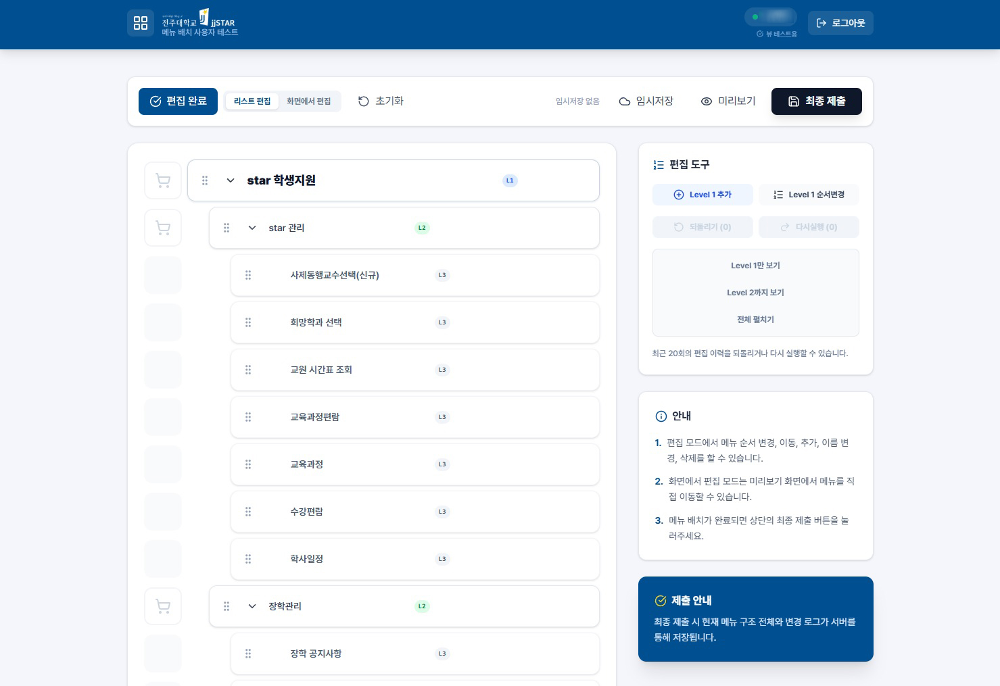
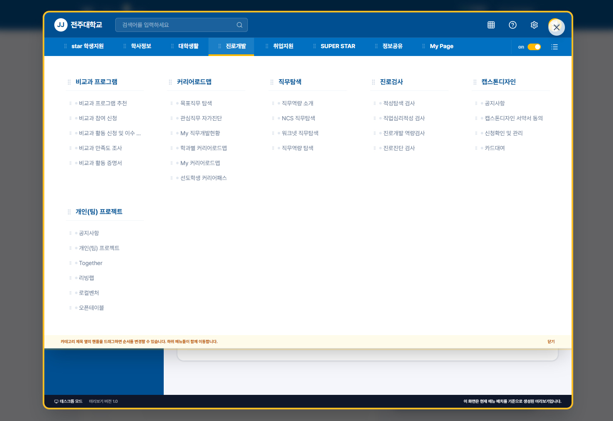

## 프로젝트 개요
※ AI를 활용하여 제작된 사이트입니다
- <b>초기 개발</b>: SDD(Spec-Driven Development) - 기본 베이스 제작
- <b>중기 개발</b>: Spec + Harness - 모듈단위 개발
- <b>서비스 검증 및 테스트 전 과정</b>: Agentic Engineering - AI 시뮬레이션 검증 및 오류 탐지, 개선 등 자동화


```
개선사항 요청 및 문의는 아래로 보내주세요  
Email: jjbd2874@jj.ac.kr
```

&nbsp;

## 프로젝트 서비스
### 서비스 방식: Git & Vercel을 통한 웹 DNS 호스팅<br>
<br>
&nbsp; - Supabase 웹DB 활용 사용자 인증<br>
&nbsp; - 쿠키 세션 활용<br>
&nbsp; - List Editor & Visual Editor 전환 기능으로 최종 배치를 확인하며 수정<br>

| jjSTAR 메뉴 편집기 | [](https://menu.jjstar.site/) |  
|:---:|:---:|  

&nbsp;

## 면책 조항
본 프로젝트는 전주대학교와 어떠한 공식적인 관련도 없습니다.<br>
본 문서에 언급된 모든 상표는 해당 소유자의 자산입니다.<br>
© 2024 JEONJU UNIVERSITY. ALL RIGHTS RESERVED.<br>  

## Disclaimer
This project is not affiliated with Jeonju University.<br>
All trademarks referenced herein are the properties of their respective owners.<br>
© 2024 JEONJU UNIVERSITY. ALL RIGHTS RESERVED.<br>  
